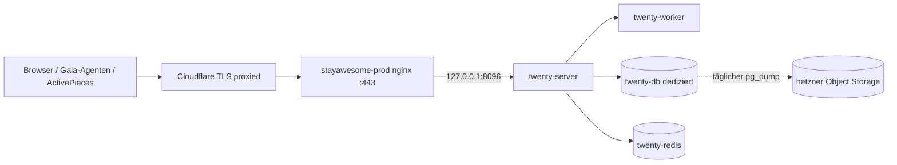

# CRM-Produktion — Twenty als Stack-Tool

## Kontext

**Entscheid (Mario, 2026-07-14):** Als OSS-CRM für alle drei Geschäftsstränge —
Immobilien, Hotel-B2B (Stay Awesome), Fundraising/Investoren — wird **Twenty**
adoptiert und auf Production ausgerollt. Das revidiert den HubSpot-Entscheid vom
2026-06-23 (`fundraising-crm-twenty-prd.md`, abandoned): Statt Fundraising-only
in HubSpot wird das CRM jetzt der gemeinsame Datenkern aller drei Domänen,
selbst gehostet und von Gaia-Agenten über API bedient.

**OSS-Scan (OSS-Skeleton-first, Entscheid 2026-07-14):** Adopt > Fork > Neubau
→ klarer **Adopt**. Geschlagene Alternativen: EspoCRM (Platz 2 — reif, aber
PHP/MySQL = Stack-Fremdkörper), YetiForce (nur falls Rechte-Granularität K.-o.
wird), CiviCRM (nur bei Fundraising-Dominanz), Odoo (ERP-Commitment), Atomic
CRM (Neubau-Bausatz, gegen die Leiter). Twenty gewinnt: Postgres-nativ,
REST+GraphQL+Metadata-API (agenten-freundlich), Custom Objects lösen das
Drei-Domänen-Problem in einer Instanz.

**Vorhandene Artefakte (Wiederaufsetz-Trail des Vorgängers):**
- `deploys/stayawesome-prod/crm/docker-compose.yml` — Compose-Recipe
  (server/worker/db/redis, `127.0.0.1:8096`, Netz `crm_default`)
- `/root/.secrets/stayawesome/crm.env` (2026-07-13) — vollständiger Env-Satz
  inkl. APP_SECRET/ENCRYPTION_KEY
- `tools/twenty/` — älteres Template + `verify-deploy.sh` (Preflight gegen die Box)

**Abgrenzung E-Mail:** Twenty verschickt nicht selbst. 1:1-Mail = Google
Workspace (Sync als Folgepaket W5), Automatisierung = ActivePieces/Gaia,
Newsletter/Bulk = **Listmonk** — der läuft bereits als eigene Spur
(`gaia-newsletter-lane-prd.md`, approved 2026-07-14, nativ auf
stayawesome-prod). Listmonk ist ausdrücklich NICHT Teil dieses PRDs.

## Ground-Truth Twenty (Recherche 2026-07-14, offizielle Doku + Repo)

- **Version:** v2.20.0 (2026-07-10); Release-Kadenz ~wöchentlich.
- **Prod-Pfad:** Docker Compose ist der einzige supportete
  Produktions-Weg (server + worker + Postgres 16 + Redis; Redis ist Pflicht).
  Ein bare-Node-Produktionspfad ist nicht dokumentiert.
- **Lizenz:** AGPL-3.0 im Kern; einzelne Dateien `@license Enterprise`
  (Commercial License). Self-Host des Kerns frei.
- **Enterprise-gated (Organization-Plan, $19/User/Monat):**
  (a) SSO via OIDC/SAML — Authentik-Anbindung ist damit NICHT im freien Kern;
  (b) Row-Level-Permissions — Record-Isolation zwischen Teams NICHT im freien Kern.
- **Frei enthalten:** E-Mail/Passwort-Login, Google- und Microsoft-OAuth-Login,
  Objekt- und Feld-Rechte pro Rolle, Custom Objects (auch via Metadata-API,
  mit auto-generierten REST/GraphQL-Endpoints), API-Keys, Webhooks.
- **Multi-Workspace:** per `IS_MULTIWORKSPACE_ENABLED` möglich
  (Subdomain-basiert), aber mit dokumentierten Bugs — Reserve-Option, kein MVP.
- **Fallstricke:** Nach jedem Image-Update `yarn database:migrate:prod`;
  `ENCRYPTION_KEY`-Verlust = Connected-Accounts weg; DB-Passwort ohne
  Sonderzeichen; `SERVER_URL` exakt; ≥2 GB RAM.

## Entscheidungen

| # | Entscheidung | Begründung |
|---|---|---|
| D1 | **Container-Ausnahme für Twenty** (Compose-Stack, wie authentik) | Kein supporteter Non-Docker-Pfad + wöchentliche Releases → nativer Build wäre ein Pflege-Fass ohne Boden. No-Docker-Linie gilt für Eigenbauten; Datastores + Third-Party ohne nativen Pfad sind die dokumentierte Ausnahme. |
| D2 | **Dedizierte Twenty-DB** (Container aus dem Upstream-Compose) statt sa-pg | Upstream-Migrationen laufen mit Superuser-Annahmen und eigener Extension-Liste; sa-pg bleibt unangetastet (wie Vorgänger-PRD G5). |
| D3 | **Auth = Twenty-eigener Login, Signup AUS; Google-OAuth sobald O1 entschieden** | Erfüllt die Public-Endpoint-Pflicht (Login-Wand). KEIN Authentik-ForwardAuth-Perimeter davor: der würde `/rest`+`/graphql` für ActivePieces/Gaia-Agenten blocken. Enterprise-SSO bewusst nicht. |
| D4 | **EIN Workspace für alle drei Domänen**; Sichtbarkeit über Objekt-/Feld-Rechte | Record-Isolation ist Enterprise-gated (Ground-Truth). Geschlossene Nutzergruppe (Mario, Gaia, wenige Mitarbeiter) → akzeptiert. Eskalationspfad = O3. |
| D5 | **Image-Tag pinnen** (v2.20.0), Upgrade-Prozedur verbindlich: pg_dump → pull → migrate → smoke | `:latest` + wöchentliche Releases = unkontrollierte Migrationen. Bestehendes Recipe nutzt `:latest` → wird beim Refresh gepinnt. |
| D6 | **Storage lokal** (Docker-Volume) im MVP; S3 (hetzner Object Storage) als Folgeoption | Anhänge anfangs klein; S3-Umzug ist reine Env-Änderung. |
| D7 | **Custom-Object-Schema skriptbar via Metadata-API** (Property/Investor + Pipelines), nicht klick-only | Reproduzierbarkeit; Agenten brauchen dieselben Objekt-Namen. Skript wird Repo-Artefakt. **Begrenzt reversibel:** nach dem ersten Live-Daten-Import ist Objekt-Löschen/-Umbau nur noch bedingt rückholbar — das Skript arbeitet daher idempotent mit Update-Logik (create-if-missing, ändern statt löschen), nie destruktiv. |
| D8 | **Recipe-Refresh vor Rollout:** Compose gegen Upstream v2.20.0 abgleichen (DB-Image, healthchecks, migrate-Step) | Recipe stammt vom 06/23er-Stand (`twenty-postgres-spilo:latest`); Upstream hat den DB-Unterbau seither gewechselt. Upstream-first statt raten. |

## Ziele (messbar)

| ID | Success-Kriterium | Verifikation |
|---|---|---|
| G1 | Twenty erreichbar unter `https://crm.stayawesome.app`, gültiges TLS | `curl -I` → 200/302 + Cert-Check |
| G2 | DNS `crm.stayawesome.app` → stayawesome-prod (178.105.36.33), CF-proxied | `dig +short` |
| G3 | Login-Wand vor jeder Funktion; Self-Signup AUS | anonymer `curl` auf geschützte Route → Redirect/401 |
| G4 | Drei Domänen abgebildet: Pipeline „Fundraising" (Lead→Erstkontakt→Pitch→DD→Term Sheet→Closed), Pipeline „Hotel-B2B", Custom Object „Property" (Immobilien) mit Basisfeldern | UI-Sichtprüfung + Metadata-API-Read |
| G5 | Twenty-DB isoliert von sa-pg (dedizierter DB-Container) | `docker ps` auf der Box |
| G6 | nginx-vhost nach system-nginx-Konvention, WebSocket-Header durchgereicht | `ls /etc/nginx/sites-enabled/crm*` + WS-Handshake |
| G7 | API agenten-bereit: API-Key existiert, `GET /rest/companies` liefert 200 mit Key, 401 ohne | `curl`-Beweispaar |
| G8 | Secrets vollständig im Vault (`crm.env` + Admin-Login + API-Key referenziert) | Vault-Sichtprüfung |
| G9 | Deploy reproduzierbar: aktualisiertes Recipe + Schema-Skript im Repo committet | Artefakte im Repo |
| G10 | Backup: täglicher `pg_dump` der Twenty-DB nach hetzner Object Storage, erster Lauf verifiziert | Timer aktiv + Objekt im Bucket |

## Nicht-Ziele

- **Kein Listmonk** (eigene Spur, s. Kontext) und keine Newsletter-Funktion in Twenty.
- **Kein E-Mail-/Kalender-Sync im MVP** — Folgepaket W5 (braucht GCP-OAuth-Client, O1).
- **Keine Enterprise-Lizenz** in dieser Phase (kein OIDC-SSO, keine Row-Level-Permissions).
- **Kein Multi-Workspace** im MVP (Reserve-Option O3).
- **Kein Fork/Custom-Build** — Upstream-Image, Config + API only.
- **Keine HubSpot-Datenübernahme in diesem PRD** — offener Entscheid O2; falls Go, eigenes kleines Folgepaket (HubSpot-Export → Metadata-/REST-Import).

## Architektur

Steuerung über das deploy-Tool: `deploy stayawesome-prod crm up|logs|restart`
(Recipe = `deploys/stayawesome-prod/crm/`). Secrets via
`env_file: /root/.secrets/stayawesome/crm.env`, nie im Repo.

## Work-Packages

**W0 — Preflight + Recipe-Refresh (werkstatt-seitig)**
- Box-Zustand lesen (RAM/Disk/Alt-Container `crm-*`, `/opt/twenty`-Reste) —
  Prod-Read braucht Marios Freigabe dieser Session oder läuft via `tools/twenty/verify-deploy.sh`.
- Compose gegen Upstream v2.20.0 abgleichen (D8): DB-Image, migrate-Kommando,
  healthchecks, `TAG`-Pin (D5). `crm.env` um fehlende Keys ergänzen
  (`SERVER_URL=https://crm.stayawesome.app` verifizieren, `SIGN_UP_DISABLED=true`).
- **Done:** Recipe committet mit gepinntem Tag; verify-deploy.sh läuft grün;
  RAM-frei ≥ 4 GB dokumentiert (Eingriffs-Schwelle: < 2 GB frei nach Start → Stopp + Box-Entscheid).

**W1 — DNS + Stack hochfahren**
- `cf-dns`: A-Record `crm.stayawesome.app` → 178.105.36.33, proxied.
- `deploy stayawesome-prod crm up`; Migrations-Step; Health.
- **Done:** `dig +short crm.stayawesome.app` zeigt CF; auf der Box antwortet
  `curl -fsS localhost:8096/healthz` → 200; alle 4 Container healthy.

**W2 — nginx + TLS**
- vhost nach system-nginx-Konvention (sites-available/-enabled), Cert
  (certbot, Muster der Box), HTTP→HTTPS, WebSocket-Header.
- **Done:** G1+G6-Beweise (`curl -I https://crm.stayawesome.app` → 200/302,
  WS-Handshake ok).

**W3 — Workspace + Schema**
- Admin-Workspace anlegen, Self-Signup AUS (G3), Admin-Creds in Vault.
- Schema-Skript (D7) gegen Metadata-API: Custom Object `Property`
  (Adresse, Status, Eigentümer-Relation), Pipeline Fundraising (6 Stages,
  Felder Ticket-Betrag/Quelle/Owner/Next-Step), Pipeline Hotel-B2B
  (Stages aus der Sales-Engine-Praxis: Lead→Kontakt→Angebot→Verhandlung→Won/Lost).
- **Done:** G4-Beweis via Metadata-API-Read; Skript im Repo; anonymer Zugriff → Login (G3).

**W4 — Agenten-Anbindung + Betrieb**
- API-Key erzeugen (G7), in Vault; ActivePieces-Connection auf Twenty
  einrichten (erster Flow: Kontakt-Anlage aus Sales-Engine als Smoke).
- Backup-Timer: täglicher `pg_dump` des DB-Containers → rclone nach
  hetzner Object Storage (G10); Restore-Probe einmal durchspielen.
- Cockpit-/Manifest-Registrierung analog Bestands-Apps; Delivery-Report.
- **Done:** G7-curl-Beweispaar; erster AP-Flow schreibt einen Testkontakt;
  Backup-Objekt liegt im Bucket; Delivery-Report committet.

**W5 (Folgepaket, nach O1) — Google-Login + Mail-/Kalender-Sync**
- GCP-OAuth-Client (Gmail/Calendar/People-Scopes, Callback-URLs exakt),
  `AUTH_GOOGLE_*` + `MESSAGING_PROVIDER_GMAIL_ENABLED` setzen; Workspace-Konten
  verbinden; Timeline-Beweis an einem echten Kontakt.
- **Done:** Login via Google-Konto funktioniert; ein synchronisierter
  Mail-Thread hängt am Kontakt.

Reihenfolge: W0→W1→W2→W3→W4 strikt; W5 entkoppelt. Gates nach ADR-0009
sinngemäß: nach jedem WP der Done-Beweis, erst dann weiter.

## Risiken

| # | Risiko | Mitigation |
|---|---|---|
| R1 | RAM-Bedarf auf geteilter Prod-Box (authentik, documenso, inbox-zero, sa-pg laufen dort) | W0 misst vorher; Schwelle: < 2 GB frei nach Start → Stopp, Mario-Entscheid Box-Upsize; Worker bleibt bei 1 Replica |
| R2 | Wöchentliche Releases + Migrations | Tag-Pin (D5), Upgrade nur bewusst mit pg_dump davor; kein Auto-Pull |
| R3 | Team-Sichtbarkeit: keine Record-Isolation im freien Kern | D4 dokumentiert + akzeptiert; Eskalation O3 (Organization-Plan ODER Multi-Workspace-Test) |
| R4 | Google-Login/Mail-Sync hängen an GCP-Klick (O1) | MVP startet mit E-Mail/Passwort — kein Blocker für W0-W4 |
| R5 | Alt-Zustand auf der Box unbekannt (Prod-Read in dieser Session geblockt) | W0-Preflight als hartes Gate; nichts wird blind überschrieben; Alt-Container/Volumes werden erst nach Sichtung angefasst |
| R6 | AGPL/Enterprise-Mischlizenz | Kern-AGPL-Betrieb ohne Enterprise-Features; keine Aktivierung Enterprise-markierter Module |
| R7 | Schema-Änderungen nach Live-Daten-Import nur begrenzt reversibel | D7-Skript idempotent (Update- statt Creation-only-Logik), keine destruktiven Objekt-Operationen; vor Schema-Umbauten pg_dump (Prozedur aus D5) |

## Offene Mario-Entscheide

- **O1 — Google-OAuth-Client (GCP-Konsole-Klick):** eigener Client für Twenty
  (Login + später Mail-Sync). Empfehlung: ja, nach W4.
- **O2 — HubSpot-Datenübernahme:** Fundraising-Stände aus HubSpot exportieren
  und importieren? Empfehlung: ja, als kleines Folgepaket nach W3.
- **O3 — Team-Trennung:** falls Immobilien-/Hotel-Nutzer sich später nicht
  sehen dürfen: Organization-Plan ($19/User/Monat) vs. Multi-Workspace-Test.
  Kein Handlungsbedarf im MVP.
- **O4 — S3-Storage:** Umzug der Anhänge auf hetzner Object Storage, sobald
  Volumen nennenswert.

## Reviewer-Verdicts

<!-- Quick/Deep-Verdicts werden hier angehängt (Datum + Verdict + Asks). -->

## Reviewer-Verdict — quick (glm-5.2) — 2026-07-14

**Verdict:** `approved`

Der PRD ist außergewöhnlich fundiert: Problem, Scope-Abgrenzung (mit präziser 'Nicht-Ziele'-Sektion), Architektur-Entscheidungen inklusive verworfener Alternativen, messbare Done-Kriterien pro Phase und offene Risiken sind vorbildlich herausgearbeitet. Es gibt keinerlei Konventionsverstöße (insbesondere keine verbotenen Zeitschätzungen).

**Findings:**
- [minor] **Reversibilität beim initialen Schema-Aufbau** — Das Schema-Skript (W3) legt Pipelines und Custom Objects an. Falls die Felder im Live-Betrieb untauglich sind, ist ein Rollback per Skript (Löschen von Custom Objects) nur bedingt reversibel, falls bereits Daten daran hängen. Das Risiko ist im MVP-Frühphase vertretbar, aber nicht explizit als 'begrenzt reversibel' markiert.

**Asks:**
- [x] Prüfe kurz, ob du in W3 oder den Risiken einen Hinweis aufnehmen willst, dass Custom-Object-Anpassungen nach dem ersten Live-Daten-Import nur noch bedingt rückverfolgbar sind (D7-Skript muss dann saubere Update-Logik statt reiner Creation-Logik enthalten). → Eingearbeitet 2026-07-14: D7 um Idempotenz-/Update-Pflicht ergänzt, neues Risiko R7.
