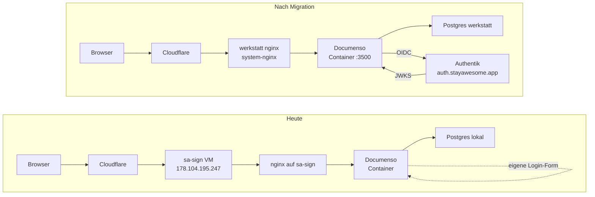

# Documenso-Migration auf werkstatt + Authentik-OIDC

## Kontext

**Heute:** Documenso (Vertragssignatur, https://sign.stayawesome.app + .dev) läuft auf separater Hetzner-VM `sa-sign` (ID 128570894, 178.104.195.247, NBG1, ~7d alt). UI-Signup ist im Self-Hosted-Build deaktiviert — User müssen via Container-internem `createUser()` händisch in der DB angelegt werden (siehe Memory `reference_documenso_self_hosted`). Stay-Awesome hat derweil auf werkstatt einen vollständigen SSO-Stack stehen: oauth2-proxy (`auth.stayawesome.app`) und Authentik (Container-Stack seit 2026-05-01, healthy 23h+). Captable und Inbox laufen schon hinter Authentik. Documenso ist die letzte Stay-Awesome-App mit eigener Login-Form auf eigenem Host.

**Vorarbeit:** [docs/plans/documenso-authentik-options.md](documenso-authentik-options.md) hat Optionen A/B/C verglichen und Option B (Documenso-natives OIDC, JIT-Provisioning) als bevorzugten Auth-Pfad markiert. Mario hat im Chat 2026-05-07 explizit zwei Schritte mandatiert: (1) Auth über Authentik aufschalten, (2) Documenso auf den werkstatt-Server konsolidieren. Dieses PRD führt beides in einer Migration zusammen, weil ein OIDC-Setup auf der wegfallenden VM Wegwerf-Arbeit wäre.

**Strategischer Rahmen:** Stay-Awesome-Apps konsolidieren auf werkstatt (Hetzner), eine VM weniger im Inventar = ein Patching-Pfad weniger, ein Backup-Profil weniger, ein Cloudflare-Origin weniger.

## Ziele (messbar)

| ID | Success-Kriterium | Verifikation |
|---|---|---|
| G1 | `https://sign.stayawesome.app/signin` zeigt Button "Sign in with Stay Awesome SSO" | curl + visuelle Inspektion |
| G2 | OIDC-Login mit Mario-Workspace-Account legt User in Documenso-DB an (JIT) | DB-Query `SELECT email FROM "User"` vor/nach |
| G3 | Alle vor Cutover signierten Dokumente sind nach Migration entschlüsselbar und sichtbar | Liste aller `Document.id` vor Cutover, nach Cutover Volltext-Render eines Samples |
| G4 | DNS für `sign.stayawesome.app` und `sign.stayawesome.dev` zeigt auf werkstatt-IP | `dig +short` auf beide |
| G5 | sa-sign-VM ist 7d quarantänisiert und dann dekommissioniert | hcloud-server-list zeigt VM weg |
| G6 | nginx-vhost auf werkstatt nutzt system-nginx-Konvention (keine Caddy/Container-Proxy-Eigenwege) | `ls /etc/nginx/sites-enabled/sign*` |
| G7 | Encryption-Key bleibt unverändert über Migration | `sha256sum` vom `NEXT_PRIVATE_ENCRYPTION_KEY` vor/nach |

## Nicht-Ziele

- Documenso-Versions-Upgrade in derselben Migration (separat).
- Multi-User-Onboarding für Stay-Awesome-Mitarbeitende (Folge-Card, sobald JIT bestätigt).
- ~~Mail-Versand-Anpassung (Documenso-SMTP-Config bleibt 1:1)~~ — **GESTRICHEN 2026-06-11:** sa-sign nutzt mailpit (Test-Catcher), Mails verlassen den Server nie. Echter SMTP-Versand ist jetzt IN SCOPE (P2).
- Forward-Auth-Variante (Option A aus options-File) — verworfen, siehe dort.
- Documenso-Daten in Hetzner Object Storage migrieren (separat, falls Volume zu groß wird).

## Architektur — Vorher / Nachher



ASCII-Übersicht für den Chat:

```
heute:    Browser → CF → sa-sign-nginx → Documenso → Postgres-lokal      (eigene Login-Form)
nachher:  Browser → CF → werkstatt-nginx → Documenso → Postgres-werkstatt (OIDC zu Authentik)
```

## Migrations-Phasen

Sechs Phasen, jede mit klarem Abschlusskriterium. Reihenfolge ist verbindlich — Cutover (P4) erst wenn P1-P3 grün.

### P1 — Inventur auf sa-sign

**Ziel:** Vollständiges Bild dessen, was migriert werden muss, bevor irgendwas angefasst wird.

- SSH-Zugang zu sa-sign herstellen (aktuell broken — Pubkey nachziehen via Hetzner-Console oder hcloud rescue).
- Aufnahme des Documenso-Stacks: docker-compose-File, Image-Tag, Volume-Mounts, Env-Vars (vollständiger `docker exec ... env`-Dump).
- DB-Größe: `SELECT pg_database_size('documenso')` und Tabellen-Counts (User, Document, DocumentData, Recipient, Field).
- File-Storage-Pfad: lokales Volume vs. S3-Konfiguration (`NEXT_PRIVATE_UPLOAD_*`).
- Aktuelle Encryption-Keys notieren in `/root/.secrets/documenso-migration.env` (NICHT git, NICHT chat).
- nginx- und certbot-Config einsehen.
- Cloudflare-DNS-Record-IDs für sign.stayawesome.app + .dev.

**Abschluss:** Inventur-Report unter `/root/stayawesome/finance/` (nein — falscher Pfad), unter `docs/sessions/2026-05-07-documenso-inventur.md`.

### P2 — Aufbau auf werkstatt (parallel, unter Stage-Domain)

**Ziel:** Documenso läuft auf werkstatt unter `sign-staging.stayawesome.dev` mit OIDC, ohne sa-sign zu berühren.

- Postgres-Schema `documenso` auf werkstatt-Postgres anlegen (empfehlenswert: dedicated DB, kein Schema in shared DB — analog zu anderen Stay-Awesome-Apps).
- docker-compose unter `/opt/documenso/` mit identischem Image-Tag wie sa-sign.
- ENVs übernehmen, Encryption-Keys 1:1 aus P1.
- File-Storage-Volume: `/opt/documenso/data/uploads/`, Owner passend zum Container-User.
- nginx-vhost `sign-staging.stayawesome.dev` mit certbot-cert (siehe Memory `reference_werkstatt_nginx_convention`).
- Cloudflare-DNS für sign-staging anlegen via cf-dns helper.
- **OIDC-Provider in Authentik anlegen** (`documenso-oidc`): Redirect-URL für Staging UND Prod, JIT-Provisioning.
- ENVs in Documenso ergänzen:
  - `NEXT_PUBLIC_FEATURE_OIDC_PROVIDER_ENABLED=true`
  - `NEXT_PRIVATE_OIDC_PROVIDER_LABEL="Stay Awesome SSO"`
  - `NEXT_PRIVATE_OIDC_WELL_KNOWN=https://auth.stayawesome.app/application/o/documenso-oidc/.well-known/openid-configuration`
  - `NEXT_PRIVATE_OIDC_CLIENT_ID=…`
  - `NEXT_PRIVATE_OIDC_CLIENT_SECRET=…`
  - `NEXT_PRIVATE_OIDC_ALLOW_SIGNUP=true`
- Smoke-Test ohne Daten: leere DB, Mario meldet sich via OIDC an, JIT-User wird angelegt, leerer Dashboard erscheint.

**Abschluss:** OIDC-Login auf Staging funktioniert mit leerer DB.

### P3 — Daten-Migration unter Maintenance-Fenster

**Ziel:** Daten (DB + Uploads) wandern von sa-sign auf werkstatt.

- Auf sa-sign Documenso-Container stoppen (Maintenance-Window).
- Postgres-Dump: `pg_dump --format=custom documenso > /tmp/documenso-<ts>.dump`.
- Files-Tarball: `tar czf /tmp/documenso-uploads-<ts>.tar.gz <upload-volume>`.
- Beides per `rsync` über Hetzner-internes Netz nach werkstatt:`/opt/documenso/migration/`.
- Auf werkstatt: Postgres-DB drop+recreate, `pg_restore`.
- Uploads-Tarball nach `/opt/documenso/data/uploads/` extrahieren, Permissions fixen.
- Container auf werkstatt starten, **kein** OIDC-Login machen (Mario ist schon User, JIT würde Konflikt provozieren) — direkt via Email/Password (alter User-Record) testen.
- Sample-Document öffnen, Volltext-Render verifizieren (G3, G7).

**Abschluss:** Alte User loggen sich auf Staging-Domain mit alten Credentials ein, alle Dokumente lesbar.

### P4 — DNS-Cutover

**Ziel:** `sign.stayawesome.app` + `.dev` zeigen auf werkstatt.

- Auf werkstatt zwei nginx-vhosts ergänzen: `sign.stayawesome.app` und `sign.stayawesome.dev` (zusätzlich zum bestehenden Staging-Host) — alle proxypassen auf denselben Documenso-Container.
- Documenso-ENV `NEXT_PUBLIC_WEBAPP_URL=https://sign.stayawesome.app` (Origin-Check, siehe Memory `feedback_documenso_origin_check`).
- certbot für beide Prod-Hosts via webroot-Method.
- Cloudflare-DNS für sign.stayawesome.app + sign.stayawesome.dev: A/AAAA von sa-sign-IP auf werkstatt-IP umschwenken via `cf-dns`.
- TTL kurz halten (Cloudflare-Default ist OK, da CF-proxied).
- sa-sign nginx weiterlaufen lassen aber HTTP 503 zurückgeben (Sicherheitsnetz, falls jemand Stale-DNS hat).
- Login auf Prod-Host testen — sowohl OIDC (G1, G2) als auch alter Email-Login (G3).

**Abschluss:** sign.stayawesome.app/.dev zeigen auf werkstatt, OIDC-Button erscheint, alte Dokumente sichtbar.

### P5 — Quarantäne sa-sign

**Ziel:** Sieben Tage Sicherheitsnetz, falls etwas Stilles ausfällt.

- sa-sign-VM bleibt **angeschaltet, aber Documenso-Container gestoppt**.
- Postgres-Dump bleibt auf sa-sign UND auf werkstatt (Doppel-Backup).
- Nach 7 Tagen ohne Incident: P6.

### P6 — Decommission sa-sign

**Ziel:** VM weg, Inventory-Sauberkeit.

- Final-Backup der sa-sign-Postgres + Uploads in Hetzner Object Storage `angelosystems-data` (siehe Memory `reference_object_storage`).
- `hcloud server delete 128570894`.
- Cloudflare-Records für sa-sign-IP entfernen, falls noch welche da.
- Memory `reference_documenso_self_hosted` aktualisieren — Host = werkstatt, OIDC live.

## Verworfene Alternativen (Review-Ask 2026-06-11)

- **Option A Forward-Auth** (nginx-Outpost + Trusted-Header): verworfen — Cross-Server-SPOF, Code-Patch nötig, kein JIT. Details: [documenso-authentik-options.md](documenso-authentik-options.md).
- **Option C Status quo** (eigene Login-Form + createUser()): verworfen — manuelles Provisioning, Login-Probleme (Mario 2026-06-11).
- **Eigene Staging-Domain** (sign-staging.stayawesome.dev): verworfen — Wegwerf-DNS/-Cert; Verifikation via localhost:3500 + Host-Header deckt dieselben Kriterien ab.
- **Verbleib auf separater VM**: verworfen — verwaister Server (Mail-Versand defekt, niemand bemerkte es), zweiter Patching-/Backup-Pfad, 3,99 €/Monat.

**P2-Done-Kriterium SMTP (Review-Ask):** Signing-Request-Mail erreicht externes Postfach — erfüllt 2026-06-11 (`sendStatus=SENT` an k.preiss@garbe.de via smtp.gmail.com).

## Risiken & Mitigation

| Risiko | Wirkung | Mitigation |
|---|---|---|
| Encryption-Key falsch übertragen → alte Dokumente unlesbar | hoch (G3, G7) | Key in `/root/.secrets/` mit `sha256sum` vor und nach Transfer abgleichen |
| OIDC-Konfig-Fehler → niemand kommt rein | mittel (G1, G2) | Email/Password-Login bleibt als Fallback aktiv (`NEXT_PUBLIC_FEATURE_OIDC_PROVIDER_ENABLED=true` schaltet Form NICHT aus) |
| DNS-Cutover schlägt fehl, Cloudflare-Cache hält alte IP | mittel (G4) | TTL 60s vor Cutover setzen, CF-Cache-Purge nach Switch |
| werkstatt-Postgres läuft voll | niedrig | DB-Größe vorher messen (P1), Disk-Usage auf werkstatt prüfen |
| sa-sign hat Files in S3 statt local-volume | niedrig | P1-Inventur klärt das, ggf. Phase-3 anpassen |
| Mario-User in alter DB hat anderes Email als in Authentik → JIT erkennt Duplikat nicht | mittel | Pre-Cutover prüfen, alte User-Record in DB notfalls Email anpassen |
| Authentik-OIDC-Provider-Config bricht Captable/Inbox | niedrig | Neuer Provider ist eigene Application in Authentik, kein Shared-State |
| sa-sign-Decom zu früh, Rollback unmöglich | hoch | 7d Quarantäne (P5) ist nicht verhandelbar |

## Rollback-Pfad

Bis Ende P5 (Quarantäne) jederzeit reversibel:
- DNS via cf-dns auf 178.104.195.247 zurückschalten
- Documenso-Container auf sa-sign hochfahren (Daten dort noch da)
- werkstatt-Setup bleibt parallel stehen, kein Daten-Verlust auf werkstatt-Seite
- Cutover beliebig oft wiederholbar, da DB-Dump idempotent

Nach P6 (Decom): irreversibel — deshalb Final-Backup in Object Storage.

## Limitations

- **L1 SSH-Engpass:** Aktuell kein SSH-Pubkey auf sa-sign. Ohne Mario-Aktion (Pubkey via Hetzner-Console nachziehen, oder rescue-mode) startet P1 nicht. **Decision:** Mario klärt Zugang vor P1-Start; alternativer Pfad wäre Hetzner-Snapshot + Mounten auf werkstatt, ist aber Brechstange.
- **L2 Email-Match Authentik vs. Documenso-DB:** JIT-Provisioning matcht über Email. Falls Mario in Documenso unter `mario@stayawesome.app` und in Workspace unter `mario.gemuenden@stayawesome.de` existiert, entstehen zwei User-Records. **Decision:** P3-Schritt "alter User-Record in DB notfalls Email anpassen" — vorher Email-Liste in P1 ziehen.
- **L3 Cross-Cloudflare-Origin-Pull:** werkstatt-IP muss bei Cloudflare als zulässiger Origin akzeptiert werden — sollte bereits sein (Captable, Inbox laufen schon dort), aber explizit verifizieren in P4.
- **L4 Documenso-Marker-Anker (siehe Memory `feedback_documenso_marker_anchors`):** Nicht betroffen, Marker-Logik ist Render-Code, kein DB-Schema.

## Rules-Compliance

| Regel / Konvention | Wo referenziert | Erfüllt |
|---|---|---|
| D1 — werkstatt nginx-Konvention (system-nginx, certbot webroot, sites-enabled) | `reference_werkstatt_nginx_convention` | ✓ P2/P4 |
| D2 — Stay-Awesome-Pfad-Layout (kein git init/rm direkt auf /root/stayawesome) | `reference_stayawesome_path_layout` | ✓ N/A für diesen Plan |
| D3 — Documenso-Origin-Check (`NEXT_PUBLIC_WEBAPP_URL` muss zur Domain matchen) | `feedback_documenso_origin_check` | ✓ P4 |
| D4 — Backup-Caches excluden bei rclone-Sync | `feedback_backup_exclude_caches` | ✓ P6 (Final-Backup) |
| D5 — Persona Stay-Awesome-Operations als "Gaia AI" | `feedback_gaia_persona` | ✓ alle Mailings/Tickets |
| D6 — externe Mail-Freigabe Pflicht | `feedback_external_send_approval` | N/A — interne Migration |
| D7 — Plan-Konvention (PRD ins Repo, Quick-Reviewer vor Beads) | `/opt/docs/konventionen/plan-konvention.md` | ✓ dieses File |

## Artifacts (was beim Vollzug existieren muss)

- [ ] `/opt/documenso/docker-compose.yml` auf werkstatt
- [ ] `/etc/nginx/sites-enabled/sign.stayawesome.app` und `…/sign.stayawesome.dev` auf werkstatt
- [ ] Authentik-Application "Documenso" + OIDC-Provider `documenso-oidc`
- [ ] Cloudflare-DNS A/AAAA für beide Hosts auf werkstatt-IP
- [ ] `/root/.secrets/documenso-migration.env` (lokal, nicht git) mit Keys-Snapshot
- [ ] Object-Storage-Backup unter `angelosystems-data:documenso-final-2026-05-…`
- [ ] `docs/sessions/2026-05-07-documenso-inventur.md` (P1-Output)
- [ ] `docs/decisions/0010-documenso-oidc-via-authentik.md` (ADR analog options-File)
- [ ] `docs/plans/documenso-werkstatt-migration-delivery.md` (nach P6)

## Open Questions

- **OQ1:** Postgres auf werkstatt — eigener Container für Documenso oder shared mit anderen Stay-Awesome-Apps? Empfehlung: shared (eine DB-Instanz, separates DATABASE), klären in P2.
- **OQ2:** Ist die sa-sign-VM Stand jetzt im Hetzner-Backup-Plan? Falls ja, Backup-Profil nach P6 entfernen.
- **OQ3:** Hat die Bestands-Documenso-DB ausser Mario noch andere User? Falls ja, müssen die in P3 informiert werden.

## References

- [docs/plans/documenso-authentik-options.md](documenso-authentik-options.md) — Optionen-Vergleich, Quelle der OIDC-Architektur-Entscheidung
- [docs/plans/sso-oauth2-proxy-rollout.md](sso-oauth2-proxy-rollout.md) — Stack-Kontext werkstatt-SSO
- Memory `reference_documenso_self_hosted` — bisherige Setup-Quirks
- Memory `feedback_documenso_origin_check` — kritischer Cutover-Stolperstein
- Memory `feedback_documenso_marker_anchors` — Render-Detail (nicht migriert, nur erwähnt)
- Memory `reference_werkstatt_nginx_convention` — system-nginx-Setup
- Memory `reference_cf_dns_tool` — DNS-Switch-Werkzeug
- Memory `reference_object_storage` — Final-Backup-Ziel
- `/opt/docs/konventionen/plan-konvention.md` — Plan-Pipeline-Kanon


---

## Scope-Update 2026-06-11 (vor Umsetzung, Mario-Go im Chat) — in Haupttext integriert, P1-P4 UMGESETZT 2026-06-11, siehe Delivery-Report

**Anlass:** Dokument an Katharina Preiss hängt mit `sendStatus NOT_SENT` — Ursache: SMTP zeigt auf mailpit (Test-Mail-Catcher), kein Versand verlässt sa-sign. Mario hat Migration + Authentik-Login erneut mandatiert ("go", 2026-06-11).

**Änderungen gegenüber Ursprungsfassung:**

1. **SMTP-Fix in Scope** (Nicht-Ziel gestrichen): mailpit → echter SMTP-Versand auf werkstatt.
2. **OIDC-Vorarbeit erledigt:** Authentik-Provider `documenso-oidc` (pk 3) + Application `documenso` existieren seit 2026-06-11. Well-Known: `https://idp.stayawesome.app/application/o/documenso/.well-known/openid-configuration` (PRD-Ursprungstext nannte auth.stayawesome.app/…/documenso-oidc — überholt). Credentials: `/root/.secrets/stayawesome/documenso-authentik-oidc.json`.
3. **P2 ohne eigene Stage-Domain:** Verifikation via localhost:3500 + nginx-Host-Header-Test statt sign-staging.stayawesome.dev — spart Wegwerf-DNS/-Cert; Cutover-Kriterien (G1-G7) unverändert.
4. **L1 (SSH-Engpass) gelöst:** Key `/root/.ssh/sa_sign_ed25519` funktioniert; Mario hat Remote-Zugriff auf sa-sign explizit freigegeben (Chat 2026-06-11).
5. **Upload-Transport-Erwartung:** v1-API-Fehler "Create document is not available without S3 transport" deutet auf database-Transport → vermutlich kein Uploads-Tarball nötig; P1 verifiziert.

## Reviewer-Verdict — quick (glm-5.1) — 2026-06-11

**Verdict:** `approved-with-notes`

Das PRD ist strukturell vorbildlich und löst ein klar belegtes Problem mit vollständiger Scope-Abgrenzung, Rollback-Pfad und ehrlichen Open Questions. Es enthält keinerlei Zeitschätzungen und alle sechs Migrations-Phasen besitzen eindeutige Done-Kriterien. Zur finalen Härte fehlen lediglich die explizite Nennung verworfener Architektur-Alternativen und die saubere dokumentsche Consolodierung des Scope-Updates.

**Findings:**
- [minor] **Architekturentscheidungen: Verworfene Alternativen nicht direkt im Text evident** — Die Optionen (A/B/C) und der Grund für die Streichung des Staging-Setups (Wegwerf-Arbeit) sind in Referenzen bzw. im Scope-Update verlinkt, tauchen aber als Architektur-Entscheidung nicht als kohärenter Block (z.B. in einem ADR-Kasten) im Haupttext auf.
- [minor] **Unschärfe durch nicht-integriertes Scope-Update** — Das Scope-Update 2026-06-11 überschreibt Teile des Ursprungstextes (z.B. OIDC-URL ändert sich zu idp.stayawesome.app, Staging-Domain entfällt). Das Dokument ist dadurch stellenweise widersprüchlich und muss vor der Umsetzung auf Konsistenz bereinigt werden.

**Asks:**
- [ ] Füge im Abschnitt 'Architektur' oder unter 'Nicht-Ziele' einen kurzen, expliziten Block 'Verworfene Alternativen' hinzu (z.B. Option A Forward-Auth, separate Staging-Domain), der die Gründe für die Verwerfung kurz benennt und auf das options-File verweist.
- [ ] Integriere die substantiellen Änderungen des Scope-Updates 2026-06-11 (neue OIDC-URL, SMTP-Fix, Entfall der Staging-Domain) direkt in den Ursprungstext, damit das PRD als konsistentes, einzelnes Dokument lesbar ist, und streiche oder markiere den Update-Anhang obsolet.
- [ ] Da SMTP-Versand nun in Scope ist (P2), ergänze in der Phasen-Beschreibung von P2 ein kurzes Done-Kriterium für den SMTP-Fix (z.B. 'Testmail von Documenso erreicht externes Postfach').
