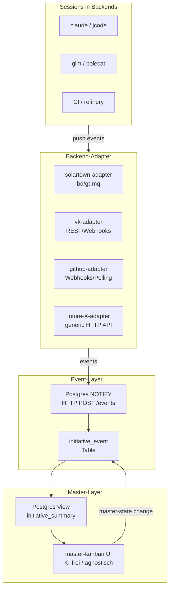

# Master-Kanban — Umsetzungsplan

Verfeinert die Vision auf eine invertierte Backend-Adapter-Architektur. Master-Kanban ist KEINE Embed-Shell, sondern eine Status-Aggregations-Schicht.

## Ziel

Eine Web-Page auf der Mario alle aktiven **Initiativen** (~2-Wochen-Brocken) firma-übergreifend sieht. Master-Kanban ist ein **Event-Sink**, der Status-Updates von Backend-Adaptern aggregiert.

**Key Inversion:** KI-Modelle leben drei Schichten unter dem Master-Kanban (Backend → Session → Modell). Master-Kanban ist KI-frei und backend-agnostisch.

## Architektur (3-Schicht)



Master-Kanban kennt nur **Initiativen**. Backend-Refs sind typed FKs (`vk_workspace_id`, `bead_id`, `gh_pr_url`, `generic_ref`).

## Stufen

### Stage 0 — Initiative-Inventur (no code)

**Deliverable:** `docs/plans/portfolio-inventur.md` mit ~38 Initiativen inkl. `primary_backend`.

Heuristik: bewegt sich nie → zu groß; bewegt sich täglich → zu klein.

### Stage 1 — HTML-Mockup

**Deliverable:** `mario-brain/mockups/master-kanban.html` (single-file).
- Alpine.js + Tailwind, Daten hardcoded.
- Fokus auf Layout (Lane-Farben) und Drill-Links.

### Stage 2 — JSON-Sync (Brücke)

**Deliverable:** `portfolio.json` als initialer Seed und CLI-Tool für manuelle Pflege vor DB-Migration.

### Stage 2.5 — Backend-Adapter-Schicht (NEU)

Eigener Stage zwischen Daten-Extraktion und UI-Persistenz.

- **solartown-adapter:** LISTEN auf bd-channel → INSERT in `initiative_event`.
- **vk-adapter:** Webhook-Empfänger für vk-Workspace-Events.
- **github-adapter:** Webhook für PR-Events oder gh-poll-fallback.
- **generic HTTP-API:** POST `/events` für zukünftige Backends (auth via api-key).

**Schema-Erweiterung:**
```sql
CREATE TABLE portfolio.initiative_event (
  id              bigserial PRIMARY KEY,
  initiative_id   text NOT NULL,
  kind            text NOT NULL, -- linked|activity|stage_proposed|unlinked|completed
  source_backend  text NOT NULL, -- vk|solartown|github|plan_file
  payload         jsonb,
  at              timestamptz DEFAULT now()
);
```

### Stage 3 — Cockpit-Page (Status-View)

**Deliverable:** `/master` Page in Cockpit (Lane A).

**Logik:**
- Cockpit-Page liest Postgres-View `initiative_summary` (aggregiert counts + last_activity aus `initiative_event`).
- Drag-Drop ändert nur **master-state**, propagiert NICHT zwingend ins Backend (Backend bleibt Source-of-Truth für eigenen State).
- **UI zeigt:** Aggregat-Counts, Activity-Sparkline, Drill-Out-Links pro Backend, Spawn-Buttons pro Backend.
- **UI zeigt NICHT:** Chat-Panel, Diff-Stream, Tool-Call-Log, iframe-Embed. KI-Interaktion lebt im Backend (neuer Tab).

### Stage 4 — Live-Sync & Events

Finalisierung der Event-driven Architektur. `portfolio.json` wird Read-Replica.

## Sessions steuern lateral (Konvention)

Jede Session in jedem Backend kennt ihre Initiative-ID.

- **vk-Session:** pusht Heartbeat + Stage-Vorschläge nach oben (via Adapter).
- **vk-Session:** kann lateral neue Beads in Solartown anlegen (auto-tagged mit Initiative-ID).
- **Solartown-Polecat:** kann lateral neuen vk-Workspace spawnen (auto-tagged).
- **Master-Kanban:** ist Event-Sink, sieht alles, steuert nichts direkt "nach unten".

## Offene Entscheidungen (aktualisiert)

| Frage | Default | Reversibel? |
|---|---|---|
| Event-Bus-Backend | Postgres NOTIFY | ja (Redis-Streams später) |
| Adapter-Authentifizierung | api-key pro Backend, secrets in `.secrets` | ja |
| Stage-Update-Propagation | nur Master (Backend bleibt SoT für sich) | ja |
| portfolio.json Rolle | Nur noch initial seed / Read-Replica | ja |
| bd-Drill-Protocol | erst `vscode://`, später `bd://` | ja |

## Out-of-Scope

- KI-Integration in Master-Kanban (lebt im Backend)
- Echtzeit-Editing-Kollisionen (Last-Write-Wins in Master-State reicht)
- Deep-Embeds (nur Links/Drill-out)
